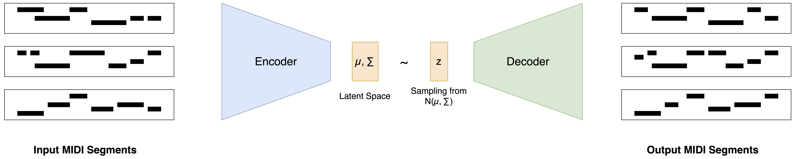

# Automatic Music Generation using Variational AutoEncoders

This project was done as part of the course "Introduction to AI and ML" at the Indian Institute of Science (IISc), Bangalore. The goal was to develop a generative model that can automatically generate piano music. Variational AutoEncoders are great generative models for such use cases where we want to learn a latent representation of the data where small "movements" in the latent space lead to smooth variations in the generated outputs.

To get the training data, we first took MIDI files of classical music by artists such as Beethoven, then using an overlapping sliding window approach constructed MIDI sequences of uniform length (to simplify things, we only considered a single instrument, piano). We then concatenated positional encoding to these feature vectors in order to add information of where these sequences occured in the music. Then we trained a VAE on this data using convolutional encoders and decoders, optimizing the reconstruction and KL loss.

For inference, we start with an initial random sample for the latent variable $z_0$, then perform a directed random walk in the latent space, generating a sequence of vectors $\{z_0, z_1, \dots, z_N \}$. These vectors are then passed batch-wise through the decoder to get sequences of MIDI which are later stiched together to get the final music.
